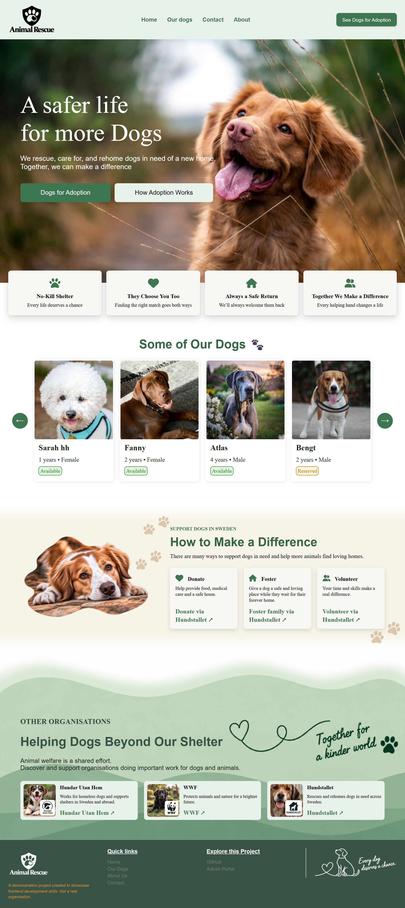
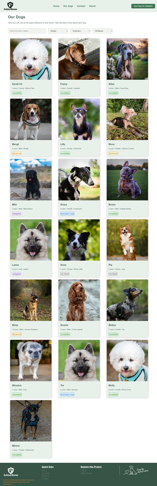
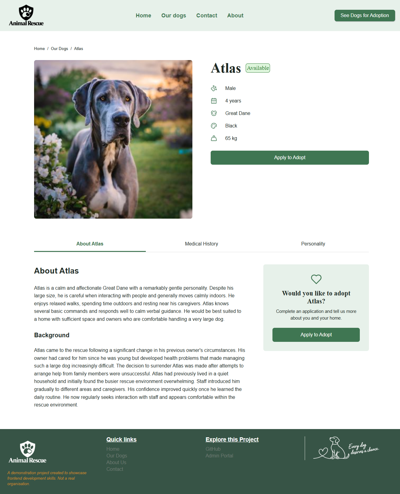
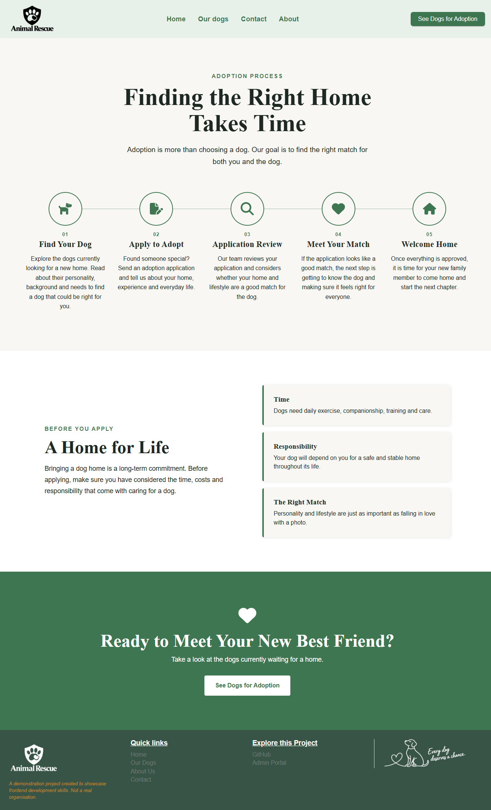
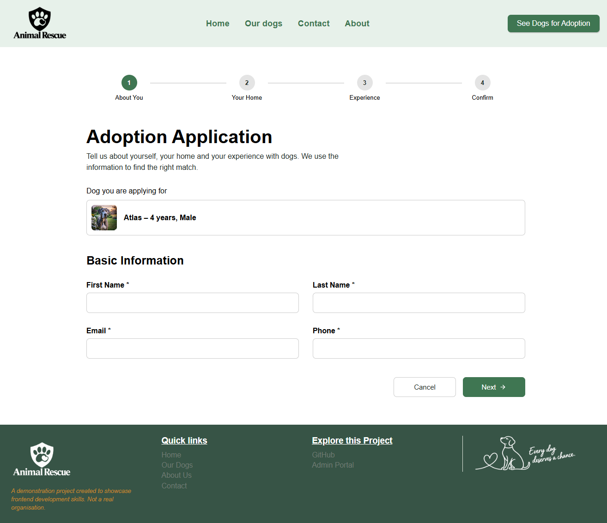
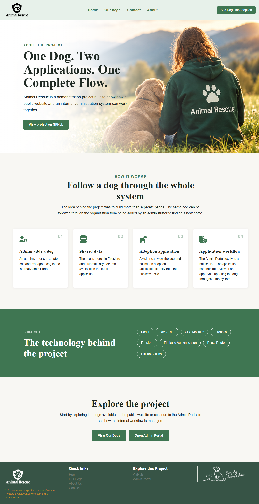

# 🐶 Animal Rescue

A public-facing animal rescue and adoption website built with React and Firebase.

Animal Rescue allows visitors to browse rescue dogs, view detailed animal profiles and submit an adoption application for a specific dog.

The application is connected to a separate role-based administration system, **Animal Rescue Admin**, through a shared Cloud Firestore database.

Together, the two applications demonstrate a complete workflow where animals are created and managed internally, displayed publicly, applied for by potential adopters and processed through an internal adoption workflow.

> ⚠️ This is a portfolio project created to demonstrate frontend development, Firebase integration, responsive UI and communication between two separate React applications.

---

## 🌐 Live Demo

**Live application:**

href="https://animal-rescue-public.web.app"


---

## 🔗 Connected Admin Application

Animal Rescue Public is the adopter-facing part of a larger system.

The internal administration application is available here:

**Animal Rescue Admin:**

https://animal-rescue-admin.web.app

The Admin and Public applications are separate React projects but share data through the same Firebase backend.

---

## 🎯 Project Overview

The purpose of Animal Rescue Public is to provide the public-facing side of an animal rescue organization.

Visitors can browse dogs currently stored in the rescue system, learn more about individual animals and submit an adoption application for a dog that is available for adoption.

The application reads animal data from Cloud Firestore in real time.

This means that animals created or updated in Animal Rescue Admin can be reflected in the Public application without maintaining a separate set of animal data.

The adoption process also works in the opposite direction.

When a visitor submits an adoption application through the Public application, the application is stored in Firestore and enters the internal Admin workflow.

This creates communication between two separate frontend applications through a shared backend.

---

## 🔄 How the Two Applications Work Together

The Public application is designed as part of an end-to-end adoption system.

```text
ANIMAL RESCUE ADMIN
Administrator creates a new dog
        ↓
CLOUD FIRESTORE
Animal is stored
        ↓
ANIMAL RESCUE PUBLIC
Dog becomes visible to visitors
        ↓
Visitor opens the dog's profile
        ↓
Visitor submits an adoption application
        ↓
CLOUD FIRESTORE
Application is stored
        ↓
Administrator receives notification
        ↓
ANIMAL RESCUE ADMIN
Administrator reviews application
        ↓
Application → In Review
        ↓
Manager receives notification
        ↓
Manager approves adoption
        ↓
Dog → Adopted
        ↓
CLOUD FIRESTORE
Updated animal status
        ↓
ADMIN + PUBLIC
Updated status is reflected across the system
```

This allows the project to demonstrate more than a standalone website.

The Public application represents the user-facing experience while Animal Rescue Admin represents the internal workflow used to process the same data.

---

## 🐕 Browse Rescue Dogs

The **Our Dogs** page displays animals retrieved from the shared Firestore `animals` collection.

The application uses a Firestore real-time listener, allowing the dog listing to respond to changes in the underlying animal data.

Visitors can:

- Browse rescue dogs
- Search by dog name or breed
- Filter by age
- Filter by gender
- Filter by status
- Open an individual dog profile

Status information is displayed directly on the dog cards to make the current state of each animal clear.

---

## 🔎 Search & Filtering

The dog listing includes client-side filtering to help visitors find relevant animals.

Current filtering options include:

- **Search** — matches dog name or breed
- **Age** — young, adult or older dogs
- **Gender**
- **Status**

Medical Hold animals are presented to public users as being **On Hold**.

Filtering happens on the animal data received from Firestore and updates the displayed dog cards without requiring a page reload.

---

## 🐾 Dog Details

Each dog has an individual details page using a dynamic React Router route:

```text
/dogs/:dogId
```

The page retrieves the selected animal from Firestore and listens for changes to that animal in real time.

The profile displays information including:

- Name
- Image
- Current status
- Gender
- Age
- Breed
- Color
- Weight
- Description
- Background/history
- Vaccination status
- Neutering status
- Medical information
- Personality information

The dog details page is divided into focused components for the main dog information and tab-based profile content.

The tabs organize:

- About
- Medical History
- Personality

This keeps the interface easy to navigate while separating different responsibilities within the React component structure.

---

## 🏠 Adoption Availability

The adoption flow is connected to the animal's current Firestore status.

A visitor can start an adoption application only when the selected dog's status is:

```text
Available
```

When the dog is available, an **Apply to Adopt** action is displayed on the dog's profile.

If the dog's status changes and the animal is no longer available, the Public application prevents a new adoption application from being submitted.

This connects the public adoption experience directly to the current state of the animal in the shared system.

---

## 📝 Multi-Step Adoption Application

The application includes a multi-step adoption form connected to the selected dog.

The form is divided into four steps:

```text
1. About You
        ↓
2. Your Home
        ↓
3. Experience
        ↓
4. Confirm
```

The application collects information such as:

- First name
- Last name
- Email
- Phone
- Housing type
- Garden availability
- Household information
- Work situation
- Other pets
- Previous dog experience
- Additional notes
- Confirmation that the submitted information is correct

The selected dog's information remains connected to the application throughout the process.

The form is divided into separate step components while the main adoption application page manages the shared form state and submission flow.

---

## 🔥 Firestore Adoption Submission

When an adoption application is submitted, the Public application first verifies that the selected dog is still available.

A new document is then created in the Firestore `adoptionApplications` collection.

The application stores information including:

- Animal ID
- Animal name
- Animal image reference
- Applicant name
- Contact information
- Housing information
- Household information
- Previous experience
- Additional notes
- Application status
- Application date

New applications enter the system with the status:

```text
New
```

The adoption application is therefore persisted in the shared backend rather than stored only in the visitor's browser.

---

## 🔔 Admin Notification

Submitting an adoption application also creates a notification for the Administrator.

```text
Visitor submits application
        ↓
adoptionApplications document created
        ↓
Administrator notification created
        ↓
Animal Rescue Admin receives notification
```

The notification contains references to both the application and the selected animal.

The Administrator can then open the Admin application and continue processing the application through the internal adoption workflow.

This is the point where the Public and Admin applications connect directly.

---

## ✅ Application Confirmation

After a successful submission, the visitor receives a confirmation view indicating that the application has been received.

The Public application does not perform the final adoption decision.

Instead, responsibility moves to the internal Admin system where the application can be reviewed by the appropriate roles.

```text
PUBLIC
Submit adoption request
        ↓
ADMIN
Process and review request
        ↓
MANAGER
Final approval
```

---

## 🔄 Real-Time Firestore Data

The Public application uses Firestore real-time listeners for animal data.

The dog listing listens to the `animals` collection, while individual dog pages listen to the selected animal document.

This means changes made to shared animal data can be reflected in the Public application without maintaining duplicate frontend data.

For example:

```text
Admin changes dog status
        ↓
Firestore document changes
        ↓
Public listener receives update
        ↓
Public UI displays current status
```

This is particularly important during the adoption workflow because the availability of an animal can change.

---

## 🧭 Application Routes

The application uses React Router for client-side navigation.

Current routes include:

| Route | View |
| --- | --- |
| `/` | Home |
| `/about` | About |
| `/adoption-process` | Adoption Process |
| `/contact` | Contact |
| `/dogs` | Dog listing |
| `/dogs/:dogId` | Individual dog details |
| `/dogs/:dogId/adopt` | Adoption application |

A shared Navbar and Footer are displayed across the application.

---

## 🏡 Home Page

The Home page introduces the rescue project and provides navigation into the adoption experience.

The page includes sections designed to communicate the purpose of the fictional rescue organization and guide visitors toward available dogs.

The interface includes:

- Hero section
- Calls to action
- Rescue principles
- Featured dog content
- Support information
- Other animal welfare organizations
- Navigation to available dogs
- Navigation to the adoption process

The goal is to make the project feel like a complete public-facing website rather than only a technical interface for displaying database records.

---

## 📋 Adoption Process

The application includes a dedicated **Adoption Process** page explaining how the fictional rescue organization's adoption process works.

The page presents the process from finding a dog and submitting an application through review, matching and adoption.

This page provides context before a visitor submits an application and complements the functional adoption form.

The actual technical workflow continues through Firebase and Animal Rescue Admin after the visitor submits the application.

---

## ℹ️ Informational Pages

The application also contains dedicated pages for:

- About
- Adoption Process
- Contact

These pages provide the surrounding content expected from a public-facing organization website while the dog and adoption views demonstrate the application's data-driven functionality.

---

## 📱 Responsive Design

The application is designed to work across different screen sizes.

The UI uses responsive CSS techniques including:

- CSS Grid
- Flexbox
- `clamp()`
- Responsive typography
- Responsive spacing
- Responsive images
- Limited media queries where necessary

The goal is to maintain the same visual structure and functionality across desktop and smaller screens without relying on a large number of breakpoints.

---

## 🔗 Shared Firebase Backend

Animal Rescue Public and Animal Rescue Admin use the same Firebase backend.

The shared backend connects the public-facing and internal sides of the project.

```text
┌──────────────────────────────┐
│     Animal Rescue Public     │
│                              │
│  Browse dogs                 │
│  Search & filtering          │
│  Dog profiles                │
│  Adoption application        │
└──────────────┬───────────────┘
               │
               ▼
        ┌───────────────┐
        │   Firebase    │
        │               │
        │   Firestore   │
        │ Security Rules│
        │   Analytics   │
        └───────┬───────┘
                │
                ▼
┌──────────────────────────────┐
│      Animal Rescue Admin     │
│                              │
│  Animal management           │
│  Adoption management         │
│  RBAC                        │
│  Notifications               │
│  Medical workflow            │
│  Calendar                    │
└──────────────────────────────┘
```

The two applications remain separate frontend projects while communicating through shared data.

---

## 🔒 Firestore Security

The Public application does not require visitors to authenticate before browsing animals or submitting an adoption application.

Firestore Security Rules control what public visitors are allowed to do.

Public animal data can be read by the application.

The adoption workflow is designed so that new public applications are associated with a valid animal and start with the expected `New` status.

The Public application also checks that the selected animal is currently `Available` before submitting an adoption application.

The Public application creates a specific notification for the Administrator when a new adoption application is submitted.

Administrative actions remain protected and are handled through the authenticated Animal Rescue Admin application.

---

## 🖼️ Image Handling

Animal images are bundled with the frontend application.

Firestore stores an image identifier on each animal document rather than storing the actual image file.

The React application maps this identifier to the corresponding local image asset.

```text
Firestore animal
        ↓
image identifier
        ↓
React image mapping
        ↓
Local image asset
```

This is an intentional choice for the portfolio project to avoid unnecessary cloud storage costs.

A production system requiring dynamic image uploads could instead use a dedicated storage solution such as Firebase Storage.

---

## 📸 Application Preview

### Home

<!-- Add screenshot: screenshots/home.png -->



---

### Our Dogs

<!-- Add screenshot: screenshots/dogs.png -->



---

### Dog Details

<!-- Add screenshot: screenshots/dog-details.png -->



---

### Adoption Process

<!-- Add screenshot: screenshots/adoption-process.png -->



---

### Adoption Application

<!-- Add screenshot: screenshots/adoption-application.png -->



---

### About

<!-- Add screenshot: screenshots/about.png -->



---

## 🛠 Tech Stack

### Frontend

- React 19
- React Router
- JavaScript (ES6+)
- CSS Modules
- Vite

### Backend & Data

- Cloud Firestore
- Firestore Security Rules

### Libraries

- React Icons

### Firebase

- Cloud Firestore
- Firebase Analytics

### Deployment

- Firebase Hosting

---

## 📁 Project Structure

```text
src/
│
├── assets/
├── components/
├── Data/
├── pages/
├── styles/
├── firebase.js
└── App.jsx
```

The application is organized into page-level views, page-specific components and reusable shared components.

Larger views are divided into focused components to keep responsibilities clear and make the code easier to maintain.

Routing is handled through React Router, while shared animal and adoption data is handled through Firebase.

---

## 🧠 Technical Concepts Used

The project includes practical implementation of:

- React functional components
- React hooks
- Component-based architecture
- Reusable components
- Props
- State management with `useState`
- Side effects with `useEffect`
- Conditional rendering
- Controlled forms
- Multi-step form state
- Client-side filtering
- Dynamic React Router routes
- URL parameters
- Cloud Firestore
- Firestore document creation
- Firestore real-time listeners
- Shared backend data between separate React applications
- Asynchronous operations
- Form submission
- Firestore Security Rules
- Event-driven notifications
- Responsive CSS
- CSS Grid
- Flexbox
- CSS Modules
- Firebase Analytics
- Vite

---

## 🚀 Installation

Clone the repository:

```bash
git clone https://github.com/MikaelaJohansson/animal-rescue.git
```

Move into the project:

```bash
cd animal-rescue
```

Install dependencies:

```bash
npm install
```

Create a `.env` file using the included `.env.example` as a reference and add the required Firebase configuration.

Start the development server:

```bash
npm run dev
```

---

## 🔄 Project Status

### Implemented

- ✅ Public responsive website
- ✅ Firebase / Firestore integration
- ✅ Real-time animal data
- ✅ Dog listing
- ✅ Search by name or breed
- ✅ Age filtering
- ✅ Gender filtering
- ✅ Status filtering
- ✅ Dynamic dog detail pages
- ✅ Animal status handling
- ✅ Adoption availability checks
- ✅ Multi-step adoption application
- ✅ Persistent Firestore adoption applications
- ✅ Administrator notification after application submission
- ✅ Shared data with Animal Rescue Admin
- ✅ End-to-end Public → Admin adoption workflow
- ✅ About page
- ✅ Adoption Process page
- ✅ Contact page
- ✅ Responsive layouts

### Deployment

- 🔄 Ready for Firebase Hosting deployment

### Connected Project

- ✅ Animal Rescue Admin deployed
- ✅ Shared Firestore backend
- ✅ Connected adoption workflow

---

## 🎓 Portfolio Purpose

This project was created to demonstrate how a public-facing React application can work together with a separate administration system.

Instead of building the Public application as an isolated frontend, the project connects it to the same animal and adoption data used by Animal Rescue Admin.

The result demonstrates a complete flow:

```text
Create animal
        ↓
Display animal publicly
        ↓
Select animal
        ↓
Submit adoption application
        ↓
Notify Administrator
        ↓
Process application
        ↓
Manager approval
        ↓
Update animal status
        ↓
Reflect updated state across the system
```

The project demonstrates both the user-facing experience and the internal workflow behind it.

---

## 👩‍💻 Author

**Mikaela Johansson**  
Frontend Developer

LinkedIn: www.linkedin.com/in/mikaela-johansson-6a59b82a5